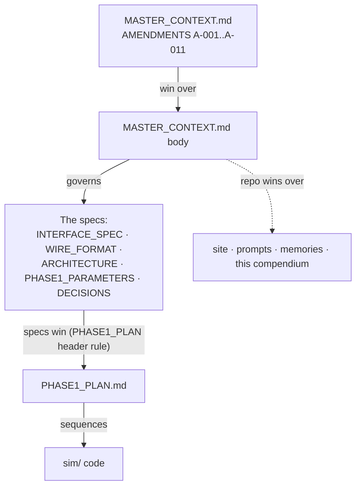
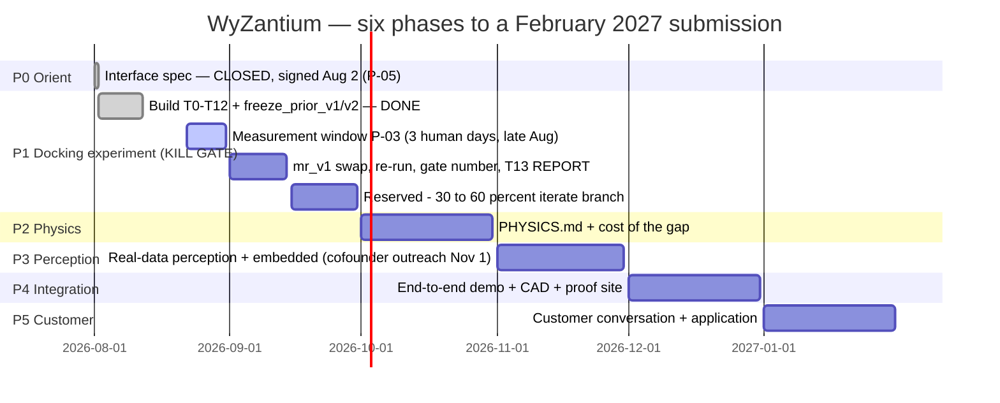
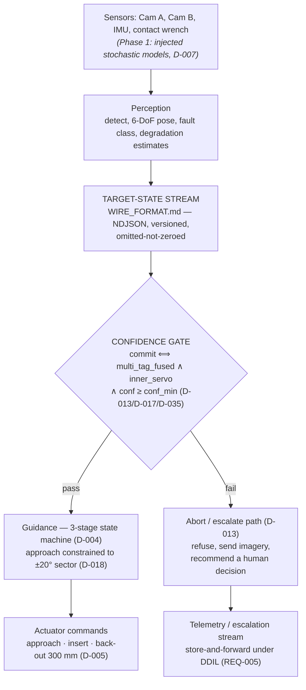
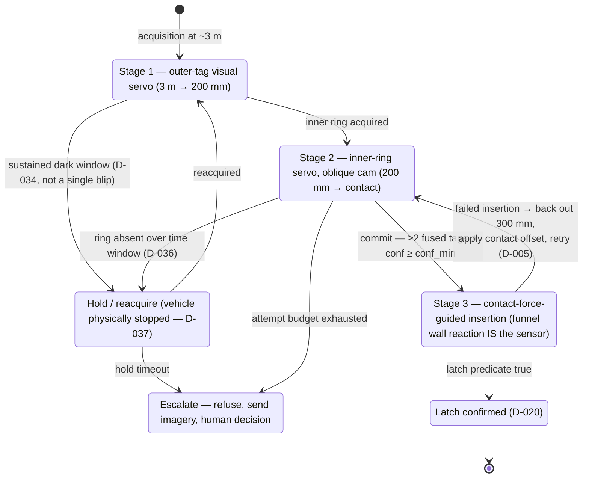
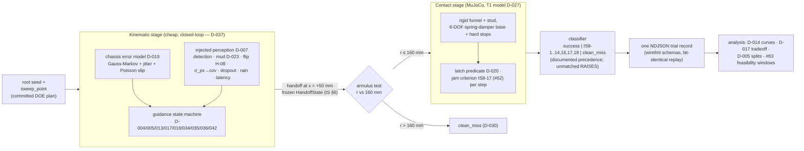
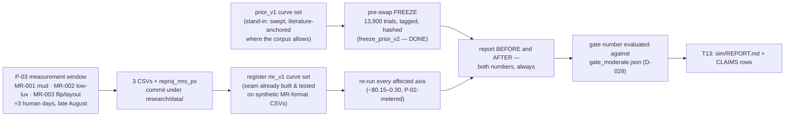
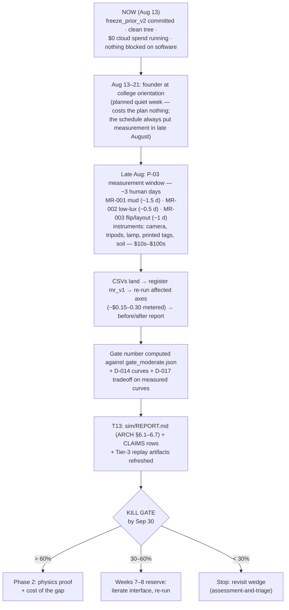

# WyZantium / Ferrier — The Compendium

**One file that explains the whole project: what it is, how it works, what has
happened, what the numbers say, and what happens next.**

Generated 2026-08-13 from the committed repo at `c7e5ff3` (freeze_prior_v2).
This is a **derived reference** — it consolidates; it does not govern. If this
file ever disagrees with a source-of-truth document, the source wins:

> **Authority chain:** `MASTER_CONTEXT.md` (AMENDMENTS win over body) → the
> specs (`INTERFACE_SPEC.md`, `WIRE_FORMAT.md`, `ARCHITECTURE.md`,
> `PHASE1_PARAMETERS.md`, `DECISIONS.md`) → `PHASE1_PLAN.md` → code. The repo
> wins over any site, prompt, memory, or this compendium.

---

## Table of contents

1. [The company on one page](#1-the-company-on-one-page)
2. [The map: documents and ID schemes](#2-the-map-documents-and-id-schemes)
3. [The six-phase plan and the kill gate](#3-the-six-phase-plan-and-the-kill-gate)
4. [The docking interface](#4-the-docking-interface)
5. [System architecture](#5-system-architecture)
6. [The Phase 1 experiment machine](#6-the-phase-1-experiment-machine)
7. [The stand-in discipline (what is real, what is simulated)](#7-the-stand-in-discipline)
8. [Results so far](#8-results-so-far)
9. [Decision register digest](#9-decision-register-digest)
10. [What is left](#10-what-is-left)
11. [Rules of the road](#11-rules-of-the-road)
12. [Glossary](#12-glossary)
13. [Figure index](#13-figure-index)

---

## 1. The company on one page

**WyZantium Industries** — autonomous recovery and servicing for unmanned
ground fleets. Target: YC Spring 2027, application submitted mid-February 2027.

**One sentence:** WyZantium builds the autonomous hand that keeps unmanned
fleets in the fight — a robot that goes forward when another robot goes down,
and does the physical work a human would otherwise walk into the kill zone to do.

**The claim everything rests on:**

> A standardized attachment interface turns autonomous battlefield recovery
> from a research problem into an engineering problem.

**Why now:** militaries are buying unmanned ground vehicles (UGVs) at scale
(Ukraine: 25,000 contracted in H1 2026; U.S. Army S-MET objective: 2,195
systems), but nobody built the support layer. When a robot is mired, dead, or
thrown a track forward of friendly lines, today's answer is to send three or
four soldiers into a drone-saturated zone. The U.S. Army asked industry about
exactly this in writing (ACC-APG RFI, 17 June 2026 — captured verbatim in
`research/RFI_ACC-APG.md`). Fleets are growing faster than the ability to keep
them running. **That gap is the company.**

**The four functions** (ordered by difficulty; 2 and 3 are the company):

| # | Function | Ours? | Why |
|---|---|---|---|
| 1 | **Find** — navigate to the asset, off-road, GPS-denied | No — integrate (Forterra, Overland AI) | commodity |
| 2 | **Assess** — classify why it stopped (mired / depleted / damaged / destroyed) | **Yes** | CV on a damaged, muddy, arbitrarily-oriented object |
| 3 | **Rig** — physically attach (tow line, charge connector) | **Yes — the crux** | this is the hand |
| 4 | **Resolve** — restart, recharge, or extract | No — purchased engineering | winches and traction are solved |

**The strategic property that makes it fundable — useful before it's perfect:**
a failed docking attempt costs a wasted trip; the fallback is exactly the
status quo (send humans). The derived trade model
(`studies/C09_VALUE_THRESHOLD.md`) shows robot-first recovery beats
humans-first whenever docking success exceeds the robot-to-human sortie risk
ratio — **of order 10–35%** across the swept parameter region. Almost no
autonomy product tolerates failure this gracefully. *(Pitch casualty avoidance,
never cost savings — the cost argument inverts when UGVs get cheap; the
casualty argument does not.)*

**The real risk, stated plainly:** robotic manipulation reliability in
unstructured environments is an open problem (published grasp success on
unknown objects: ~75–87%, indoors, clean). WyZantium attaches to a mud-covered
500 kg vehicle at night at an arbitrary angle. **The mitigation is the thesis
itself:** require a standardized recovery interface on the target, and an
open-ended *grasping* problem becomes a constrained *docking* problem — the
trick every drone dock on earth relies on. That converts a physics risk into a
standards-adoption risk, which is a business problem a founder can attack.

**Phase 1 exists to measure whether that conversion actually works.**

**Build strategy:** WyZantium is not building a vehicle in six months. It is
building **evidence that the vehicle would work**, at near-zero capital cost —
three tiers per subsystem: **Built** (real, tested code), **Derived**
(closed-form physics, sourced), **Modeled** (CAD/concept, labeled). Nothing is
presented as more real than it is. The end state of the program is a YC demo
plus the ask **"the gap is capital"** — evidence the machine would work, and a
priced plan (`COST_OF_GAP.md`) for the money to build it.

---

## 2. The map: documents and ID schemes

### 2.1 Document map

| File | Role |
|---|---|
| `MASTER_CONTEXT.md` | Canonical: company, plan, rules. **Amendments section wins over body.** |
| `NO_HARDWARE.md` | Procurement law: instruments, not artifacts (rev 2) |
| `DECISIONS.md` | Every design decision, D-001…D-046; specs cite these |
| `ROADMAP.md` | Phase status board (🟢🟡⬜🧊), updated Fridays |
| `HOW-FAR-ALONG.md` | One-paragraph plain-language status |
| `INTERFACE_SPEC.md` | The docking target: stud, fiducials, frames, tolerances, §8 failure rows, §9 degradation axes |
| `ARCHITECTURE.md` | Four functions, data flow, real-vs-simulated table, sim + compute plan, Phase 1 output spec §6 |
| `WIRE_FORMAT.md` | The one wire contract: target-state stream + trial records; omitted-not-zeroed rule |
| `PHASE1_PARAMETERS.md` | All 65 parameters with sources (#1–#65) |
| `PHASE1_PLAN.md` | Phase 1 execution map: T0–T13 build order, verification gates, schedule |
| `HOLES.md` | Gate ledger: every unknown and which sanctioned door closed it |
| `FAILURE_TAXONOMY.md` | IS8 failure rows as classifiable events + classifier precedence |
| `MEASUREMENT_REQUESTS.md` | The **only** channel to physical measurement (MR-001…004) |
| `PENDING_HUMAN.md` | Everything owed by the human, one ledger (P-01…P-08) |
| `CLAIMS.md` | Claims register: no external claim without a row (C-01…C-14) |
| `COST_OF_GAP.md` | Phase 2 scaffold: what the capital buys (empty by rule until Phase 2) |
| `FAILURE_TAXONOMY.md` | Trace→outcome mapping reference |
| `sim/REPORT.md` | T13 deliverable — currently a stub by design (written after the curve swap) |
| `studies/` | H04 funnel compliance (T1 ratified), H08 ambiguity model, C09 value threshold, R01 review |
| `research/` | Week-1 primary sources: RFI verbatim, requirements, standards, vendors, follow-on, perception prior |
| `sim/` | The experiment: `wirefmt/` (contract) + `wyzantium_sim/` (harness) + `scenarios/` + `results/` |

### 2.2 ID schemes (how to read any cross-reference in this repo)

| Prefix | Meaning | Lives in |
|---|---|---|
| **D-0xx** | Ratified design decision | `DECISIONS.md` |
| **A-0xx** | Amendment to MASTER_CONTEXT (wins over body text) | `MASTER_CONTEXT.md` AMENDMENTS |
| **P-0x** | Pending/completed human action | `PENDING_HUMAN.md` |
| **H-xx** | Hole (unknown) and its closure door | `HOLES.md` |
| **MR-00x** | Measurement request (the only path to physical data) | `MEASUREMENT_REQUESTS.md` |
| **C-xx** | External claim + evidence + label + status | `CLAIMS.md` |
| **F-0xx** | R01 review finding | `studies/R01_PHASE1_REVIEW/FINDINGS.md` |
| **IS8-n** | Failure mode, row n of INTERFACE_SPEC §8 | `INTERFACE_SPEC.md` §8 |
| **T0–T13** | Phase 1 build tasks | `PHASE1_PLAN.md` §4 |
| **REQ-0xx** | Requirement extracted from the Army RFI | `research/REQUIREMENTS.md` |
| **#NN** | Parameter row (1–65) | `PHASE1_PARAMETERS.md` |

**Hole-closure doors** (`HOLES.md` — nothing closes by invention): Door 1
**DERIVED** (arithmetic shown) · Door 2 **SOURCED** (page-verified citation) ·
Door 3 **DECIDED** (promoted to a D-xxx) · Door 4 **SWEPT** (declared Phase 1
parameter with range + honestly-labeled default). There is no fifth door.

### 2.3 Document authority



---

## 3. The six-phase plan and the kill gate



| Phase | Window | Objective | Gate | Status |
|---|---|---|---|---|
| 0 | Aug 1–14 | Orient; define the interface | Spec written | 🟢 signed 2026-08-02 (P-05) |
| 1 | Aug 2 (early start, A-011) – Sep 30 | **The docking experiment** | ⚠️ **KILL GATE** | 🟡 in progress |
| 2 | October | Physics proof (closed-form, sourced) + cost of the gap | `PHYSICS.md` | ⬜ |
| 3 | November | Perception + embedded on **real** data; cofounder outreach starts Nov 1 (A-009) | measured accuracy | ⬜ |
| 4 | December | Integration, CAD, proof site, cofounder | end-to-end demo | ⬜ |
| 5 | January | Customer contact, application (4 rewrites min.) | named human | ⬜ |
| — | February | Submit | — | ⬜ |

**The kill gate** — one question, one number: *given a standardized target
interface, what fraction of autonomous approach-and-latch attempts succeed
under realistic field degradation?*

| Result over the D-029 moderate band | Meaning | Action |
|---|---|---|
| **> 60%** | Thesis holds | Proceed to Phase 2 |
| **30–60%** | Holds conditionally | Iterate interface / active illumination / tactile; two weeks, re-run (weeks 7–8 reserved) |
| **< 30%** | Interface does not sufficiently constrain the problem | **Stop.** Revisit the wedge: assessment-and-triage instead of physical rigging |

A bad number is the experiment *working*, not the company failing — finding
out in September with five months of runway is the entire point.

**The gate cell is pre-committed** (D-029, closing hole H-13 — otherwise the
cell could be chosen after seeing results, which is refitting). Transcribed
verbatim to `sim/scenarios/gate_moderate.json`; code never hardcodes it:

| Axis | Moderate band |
|---|---|
| Outer-tag occlusion | {30, 40}% |
| Inner-ring occlusion | {30, 40, 50}% |
| Illuminance | {50, 100} lux |
| Rain | 10–20% |
| Sensor dropout | p = 0.05, bursts on |
| Lens contamination | 10–25% aperture |
| Fiducial destruction | none (that is target damage, not environment) |

Host pitch/roll, view angle, and range marginalize over their full committed
distributions; all swept *system* parameters sit at labeled defaults. Gate
trial count: **N = 5,000** (D-038; CI half-width ~1.3 pp worst case).

---

## 4. The docking interface

The product's core idea in steel: the target vehicle carries a standardized,
passive, cheap **target-side assembly**; the recovery vehicle carries the
smart, expensive **head**. All serviceable complexity lives on the recovery
side (D-001 — "mating principle is split").

**Topology (D-027, human-ratified as T1):** rigid steel capture funnel on the
recovery head + rigid stud on the target, with **compliance and
instrumentation in the head's base mount** (one 6-DOF spring-damper + hard
stops in sim). Matches three independent prior-art traditions: Draper RCC
(remote center compliance), IDSS/NASA soft-capture docking, automated
fifth-wheel truck coupling (CLAIMS C-12, all sourced).

```
        TARGET SIDE (passive, cheap)              RECOVERY SIDE (smart, expensive)

        200 x 200 mm plate
   ┌─────────────────────────┐
   │   ┌───────────────┐     │                          ╲         ╱
   │   │  outer tag    │     │  150 mm AprilTag          ╲       ╱   funnel:
   │   │  36h11, ID-0  │     │  center +185 mm            ╲     ╱    mouth  Ø220 mm
   │   └───────────────┘     │  above stud axis            ╲   ╱     depth  180 mm
   │  ○ ○ ○  inner ring ○ ○ ○│  8 x 10 mm tags,             ╲ ╱      throat Ø42 mm
   │      (radius 55 mm)     │  readable to contact          █       (half-angle ~26°)
   │          ╔══╗           │                               ▲
   │          ║  ║ stud      │  neck Ø25 mm                  │ Cam A on-axis
   │          ║  ║           │  head Ø40 mm (spherical cap)  │ Cam B oblique 30° (D-025)
   │          ╚══╝           │  exposed length 90 mm         │ + contact wrench sensing
   └─────────────────────────┘                               │ compliance k + hard stops
        [ASSUMED dims, D-016 — Phase 2 verifies]             │ in the base mount (T1)
```

Key committed decisions about the interface:

- **Fiducials (D-010, D-011):** AprilTag 36h11, reference C implementation
  (richest published characterization of any tag family). **Nested two-scale
  constellation:** one 150 mm outer tag for 3 m acquisition + a ring of eight
  10 mm tags readable to contact. Every tag ID maps to a known rigid offset
  from the stud frame → any single visible tag yields full 6-DoF pose — **but**
  single small tags are orientation-flip-prone (H-08 study), so **insertion
  commit requires ≥ 2 fused tags** (`pose_source: multi_tag_fused`).
- **Two candidate inner-ring layouts** (coplanar vs. raised collar) are carried
  in the spec; **MR-003's measured flip rate selects the winner** (D-011).
- **Capture envelope (D-015, assumed):** ±35 mm positional, ±10° angular at
  the capture plane — the funnel mouth is derived from this plus head radius.
- **Load ratings (D-003-R):** latch tension 15 kN (assumed, C-05); stud neck
  bending 462 N·m design moment, SF ≈ 2.2 at sector edge (derived, C-06).
- **Approach/tow sector (D-018):** ±20° about the stud axis, normative.
- **Cameras (D-012, assumed):** two 1920×1200 global-shutter mono; Cam A
  on-axis ~70° HFOV, Cam B oblique ~90–100° HFOV. Cam B's obliquity is
  load-bearing: the pose-ambiguity flip is worst near head-on, and Cam B is
  never head-on.

**Failure modes are enumerated up front** (INTERFACE_SPEC §8, rows 1–18) and
Phase 1 classifies every failed trial against them — see §6.4 below.

---

## 5. System architecture

Contract-first (inherited from Ghost Medic): **one wire format between every
stage**, so any producer swaps for any other without touching consumers.



**The confidence-gated abort is the product's honesty discipline in steel:**
below-threshold pose confidence → the system refuses to attempt, sends
imagery, and recommends a human decision. There is **no non-visual fallback
that produces metric pose** (D-013) — a silhouette-fit fallback would be
confident enough to act on and wrong enough to destroy the asset it was sent
to save.

**Three-stage terminal guidance (D-004)** with the persistence semantics that
closed H-18 (D-034/035/036) and the attempt-seam resets from R01 (D-042):



Retries make `attempts-per-encounter` an explicit swept parameter, and
first-attempt vs. multi-attempt success are **reported as separate
distributions** (D-005).

---

## 6. The Phase 1 experiment machine

### 6.1 Shape of the experiment

**Two-stage simulation (D-006):** cheap kinematic approach/acquisition;
full contact physics only on the last 50 mm, only for trials whose predicted
stud-head center crosses x = +50 mm, evaluated on a **160 mm annulus** around
the funnel mouth (near-misses must score as misses, or the headline number is
manufactured; r > 160 mm at the capture plane = kinematic `clean_miss`,
D-030). **Perception is injected, not rendered (D-007)** — no renderer exists
anywhere in Phase 1. Engine of record: **MuJoCo 3.11.0** (D-039; Newton
adapter stays in-tree as a labeled stub).



### 6.2 Code structure

Two installable packages under `sim/`:

- **`sim/wirefmt/`** — the contract package. Stdlib-only. JSON Schemas
  (`target_state`, `trial_header`, `sim_truth`, `trial_result`), a validator
  implementing the consumer checklist (including omitted-not-zeroed), a
  canonical NDJSON writer (fixed key order, shortest round-trip floats — this
  is what makes bit-identical replay possible), and golden + negative
  fixtures. Phase 3's C firmware must pass the same fixture corpus.
- **`sim/wyzantium_sim/`** — the harness: `params` (all 65 entries,
  transcription-tested against the doc), `frames/geometry`, `rng` (one root
  seed → named substreams), `kinematic/`, `perception/` (with the
  **curve-swap seam** — registry {`prior_v1`, `mr_v1`}, active set stamped
  into every trial header), `guidance/`, `contact/` (engine-neutral
  `ContactEngine` protocol; MuJoCo + Newton adapters), `classify/`,
  `logging/`, `trial.py` (the unit of replay), `doe/` (tier generators,
  resumable runner, **spend metering against the $100 ceiling**), `replay/`
  (byte-identical verify + A-007 artifacts), `analysis/` (refuses to pool
  across curve-set IDs).

Build tasks T0–T13 each carried a verification gate (`PHASE1_PLAN.md` §4);
**T0–T12 are done**; T13 (the REPORT) is written after the curve swap, by
design. Test suite: ~537 tests green (8 Newton skips on the M4 — it has no
CUDA; MuJoCo is the local dev engine regardless of production winner).

### 6.3 The DOE (D-021, D-032, D-038)

| Tier | What | Size (v2) |
|---|---|---|
| 1 | One-axis marginal grids → D-014 sensitivity curves per axis | 4,900 trials, 98 cells |
| 2 | Latin-hypercube sample across all axes jointly → interaction check | 4,000 trials |
| Gate | The D-029 moderate band, system defaults | 5,000 trials (D-038) |
| 3 | Replay artifact set: ≥1 successful dock + ≥1 per failure class (A-007) | small, curated |

Committed grids, seed rule, resume semantics, and spend metering are all
D-032; the runner survives kill/resume; cumulative spend is metered against
the **P-02 $100 hard ceiling** (external backstop: AWS budget alarm
`wyzantium-p02-ceiling`).

### 6.4 Failure taxonomy (INTERFACE_SPEC §8 → outcome classes)

Every failed trial is classified against the committed rows; an unmatchable
trace **raises** (recorded-amendment path — never a guessed label):

| Row | Failure | Response in one line |
|---|---|---|
| IS8-1 | Outer tag partially occluded | continue if conf ≥ threshold; hold; escalate on timeout |
| IS8-2 | Outer tag destroyed / not detected | close on inner ring only if policy allows; else escalate |
| IS8-3 | Inner ring occluded (< 2 tags inside 300 mm) | abort insertion, back out, reacquire |
| IS8-4 | Inner ring destroyed | **no insertion attempt**; escalate |
| IS8-5 | Pose ambiguity flip | reject frame; need multi-tag/oblique confirm; persistent → abort |
| IS8-6 | Stud bent | back out after N anomalous contacts; escalate |
| IS8-7 | Stud sheared / missing | abort; escalate |
| IS8-8 | Plate detached / shifted | pose invalid; escalate |
| IS8-9 | Funnel packed with debris | back out, retry; escalate |
| IS8-10 | Latch fails to engage | retry; escalate |
| IS8-11 | Latch engages, does not lock | **no tow load**; re-seat; escalate |
| IS8-12 | Latch will not release post-mission | human manual release (head = serviceable side) |
| IS8-13 | Host frame member deformed | abort; escalate |
| IS8-14 | Wrong-ID decode | reject frame; persistent → escalate |
| IS8-15 | Comms loss mid-attempt | **nominal, not a failure** — continue autonomously (DDIL by requirement) |
| IS8-16 | Lip strike (contact in the [110, 125] mm band) | own class — can deflect into a **false capture**, counted separately |
| IS8-17 | Jam at the throat (sustained high-axial / near-zero-lateral, no latch) | back out (the designed unjam); own class |
| IS8-18 | Insertion incomplete at encounter budget (D-033) | own class — budget artifact, never folded into row 10 |

### 6.5 Determinism and reproducibility

Every trial writes one NDJSON record replayable **bit-identically** from its
header (seed, code SHA, engine, sweep point, curve-set ID, compute-instance
identity per D-046(f)). The committed deliverable is the **regeneration
closure** — plans + seed rule + code SHA + per-record sha256 lists — not
retained record bulk (records regenerate deterministically; byte-identity is a
per-instance-class contract, cross-platform float divergence measured in
`sim/results/review_r01/F-018/`). The freeze builder is `tools/freeze_v2.py`.

### 6.6 Compute (A-004, D-039, P-02)

- Measured cost: **$0.0095 per 1,000 trials** on a c7i.8xlarge spot instance
  (32 workers, ~1.4 CPU-s/trial). The GPU leg of A-004 was **waived as moot**
  (D-039): the entire frozen DOE cost ~$0.25; no GPU rate could recover its
  own provisioning cost at this scale.
- freeze_prior_v2's 13,900 trials metered **$0.132** total
  (`sim/results/freeze_prior_v2/spend_ledger_v2.json`).
- AWS: account on credits ($180), P-02 $100 ceiling, budget alarm backstop,
  **zero resources left running** between sessions; dead-man `shutdown -h +180`
  on every spot instance. The M4 MacBook is a terminal, not a compute ceiling.

---

## 7. The stand-in discipline

This is the load-bearing methodology of the whole program: **everything
physical has a labeled software stand-in, and every stand-in has a named exit.**

### 7.1 Real-vs-simulated table (condensed from ARCHITECTURE §3)

| Subsystem | Tier | What stands in for what |
|---|---|---|
| Wire contract, validators | **Built** | nothing — real code |
| Abort / confidence gate | **Built** | nothing — real code under test |
| Harness, logging, replay | **Built** | real code; its *inputs* are simulated and labeled |
| Contact physics (last 50 mm) | Simulated | MuJoCo solver stands in for hardware docking trials |
| Approach kinematics | Simulated | kinematic model + injected error stands in for a real vehicle on terrain |
| Perception: detection | **Swept → pending MR-001/002/003** | a swept plausible range (literature-anchored where the corpus allows) stands in for a measured curve |
| Perception: mud response | Extrapolated → pending MR-001 | clean-occlusion literature extrapolated — **no supporting data** until MR-001 |
| Perception: pose covariance | Swept → pending MR bench | swept σ_px stands in; replaced by measured `reproj_rms_px` |
| Cameras | Modeled (assumed) | D-012 parameters stand in for hardware |
| Interface geometry | Modeled | D-016 parametric definition stands in for fabricated parts |
| Tow forces, power, thermal | Derived (Phase 2) | closed-form with sourced numbers stands in for testing |
| Fault classifier | Stub → Built in Phase 3 | assumed stub until real imagery |

**The honest headline is built to survive this:** the primary Phase 1 output
is **docking success as a function of detection rate** (D-014) — a sensitivity
curve that does not depend on any single perception value being correct — plus
the **refusal-vs-damage tradeoff curve** (D-017), which prices the abort
discipline. The sanctioned phrasing is C-14: curves are *swept across the
plausible range*; "literature-derived perception curves" may **not** be claimed.

### 7.2 The curve-swap protocol (how stand-ins exit)



Silently improving an input mid-experiment is the same failure as refitting a
model after seeing the answer — hence: freeze first, swap on the record,
report both. Every trial header carries its curve-set ID and the analysis code
**refuses to pool across curve sets**.

### 7.3 NO_HARDWARE rev 2 — instruments, not artifacts

**Nothing in this program gets built.** No part of the product is purchased,
fabricated, or assembled. The narrow carve-out: **measurement instruments**
(camera, lenses, printed tags, lighting, tripod-class furniture, consumables)
are permitted only when a committed decision depends on a number that cannot
be honestly derived or sourced — gated by the three-question test, channeled
exclusively through `MEASUREMENT_REQUESTS.md`. A tripod photographing a muddy
printed tag is an instrument; the same plate on a powered slide is the
beginning of a robot nobody has time to finish, and is prohibited.

**The escalation rule:** when an honest number is unavailable, never invent,
estimate, or plausibly interpolate — file a measurement request and stop. A
blocked analysis that names its blocker is a success.

**The source-integrity rule:** a summarizer's output is never a source.
Numbers land in committed documents only from pages read directly (an
automated fetch summary of Olson 2011 once returned plausible *fabricated*
values — that failure wears the shape of a successful fetch, and the
discipline that caught it is now mandatory procedure).

---

## 8. Results so far

### 8.1 The story in five acts

1. **Built and proven (Aug 2–8):** T0–T10 landed with per-task verification
   gates; 537-test suite green; first cloud instance provisioned; A-004 CPU
   cost measured ($0.0095/1k trials); #33 solver convergence probe: timestep
   2e-4 s confirmed.
2. **H-18 found and closed (Aug 9):** the first gate-cell probe returned
   **0.0% over 500 trials** — traced to three composition bugs, all the same
   disease (per-frame readings of §8 rows against stochastic 30 Hz
   detection): row-2 escalation with no persistence (a 0.17 s sensor blip
   killed whole missions), conf_min applied at every stage instead of
   commit-scope, ring absence counted in frames instead of time. Each fixed as
   a human-ratified decision (D-034/035/036) with before/after probe
   artifacts. The residual honest behavior: at the gate cell the machine
   overwhelmingly **refuses** rather than attempts.
3. **First freeze (Aug 9):** `freeze_prior_v1` — 13,400 trials at `b493e7a`.
   Gate cell 0.0% (N = 5,000, CI [0, 0.08%]), all policy refusals.
4. **R01 surgical review (Aug 11):** 8 lanes + adversarial prosecution, 16
   agents, **225/225 contract clauses verdicted; 24 findings survived, 0
   rejected** — including F-012: every frozen trial had the target orientation
   realized as Ry(180°) instead of Rz(180°), i.e. viewed the wrong way up
   (camera view angles 4–48° worse than nominal). The human ratified the whole
   fix packet in one sitting (**P-08 → D-039…D-046**); every fix landed with
   before/after evidence.
5. **Second freeze (Aug 12):** `freeze_prior_v2` — 13,900 trials at
   `f6325bd`, $0.132 metered. The fixes were real; the verdict is unchanged.

### 8.2 The frozen numbers (pre-swap, on stand-in curves — labeled as such)

| Dataset | N | Success | Rate | 95% CI (Wilson) | Outcome census |
|---|---|---|---|---|---|
| **Tier 1** (one-axis marginals, 98 cells) | 4,900 | 4,313 | **88.0%** | [87.1%, 88.9%] | 537 IS8-1, 50 IS8-2 |
| **Tier 2** (LHS, all axes jointly) | 4,000 | 39 | **0.98%** | [0.71%, 1.33%] | 2,064 IS8-2, 1,897 IS8-1 |
| **Gate cell** (D-029 moderate band) | 5,000 | 0 | **0.0%** | [0%, 0.077%] | 4,964 IS8-1, 36 IS8-5 |

**How to read this honestly:**

- In clean/near-nominal conditions, docking succeeds **~88%** of the time.
- Under the moderate mud-and-darkness band the gate is scored on, the robot
  **refuses every attempt** — 100% of gate-cell outcomes are *policy
  refusals* (low-confidence escalations and ambiguity rejections), zero
  crashes, zero asset damage. The abort discipline is doing exactly what
  D-013 says it should when its cameras cannot clear the confidence bar.
- The refusal is built on **stand-in perception curves** (`prior_v1`). The
  mud-degradation axis — the one the whole band hangs on — is *extrapolated
  with no supporting data* until MR-001. **The one honest lever on the gate
  number is the P-03 measurement window.** Everything downstream of the three
  CSVs is already built and tested.
- Taken at face value today, 0% < 30% would read "stop." That reading is
  premature by the program's own rules: the gate is evaluated **after** the
  mr_v1 swap, reporting before/after both.

### 8.3 Feasibility windows (#63, D-026/D-028)

Per vehicle class (traction μ_trac, mass m_rv): the class can dock iff the
sim-required stiffness band intersects the derived static window
[k_min, k_max], k_max = μ_trac·m_rv·g/35 mm. Example from
`sim/results/freeze_prior_v2/feasibility_63.json`: (μ=0.2, 300 kg) →
k_max ≈ 16.8 N/mm → grid cells k ∈ {30, 70} N/mm masked infeasible; heavier /
higher-traction classes open wider windows. **Interpretation rule (D-028):
empty intersection = cannot dock; partial overlap = a narrower usable band — a
tuning finding, never an elimination.** Static-only caveat attached (C-13);
Phase 2's dynamic analysis may lower k_max.

### 8.4 What the R01 review was (for future reference)

`studies/R01_PHASE1_REVIEW/` — an auditable 225-row matrix (every committed
contract clause × the code), 8 review lanes, adversarial prosecution of every
finding, two independent agents reproducing each confirmed number, verdicts
merged by a deterministic tool (never hand-edited). 24 findings → 8 behavioral
(Class B, ratified at P-08), the rest mechanical/doc repairs. The freeze that
followed validates the fix set: the D-042 attempt-seam artifacts are gone, and
the 36 IS8-5 ambiguity refusals only exist because D-043 made flip realism
real.

---

## 9. Decision register digest

One line each — the full reasoned text lives in `DECISIONS.md`.

### Interface & guidance

| ID | Decision |
|---|---|
| D-001 | Mating principle split: passive/cheap target side, smart/serviceable recovery side |
| D-002 | Heritage claimed through mounting boss + load path only |
| D-003-R | Two load ratings: latch tension 15 kN (assumed) + stud neck bending 462 N·m (derived) |
| D-004 | Three-stage terminal guidance; open-loop dead-reckoning rejected |
| D-005 | Retry loop: back out 300 mm, apply contact offset; attempts swept; first/multi reported separately |
| D-010 | AprilTag 36h11, reference C implementation |
| D-011 | Nested two-scale constellation; ≥2 fused tags to commit; MR-003 selects the layout |
| D-012 | Sensor parameters assumed; Cam B obliquity is load-bearing |
| D-013 | No non-visual fallback that produces metric pose — refuse and escalate instead |
| D-015 | Capture envelope ±35 mm / ±10° (assumed; Phase 2 verifies) |
| D-016 | One named provisional dimension set; changes are recorded revisions, not code edits |
| D-017 | conf_min is a swept parameter {0.50–0.95}; the tradeoff curve is a deliverable |
| D-018 | ±20° approach/tow sector, normative |
| D-024 | Host integration envelope: requirements levied on integrators, not facts |
| D-025 | Cam B obliquity 30°, band [15°, 45°] |
| D-027 | **T1 topology ratified**: rigid funnel/stud, compliance + instrumentation in the base mount |

### Simulation & measurement method

| ID | Decision |
|---|---|
| D-006 | Two-stage sim; contact only on last 50 mm; 160 mm annulus so near-misses score as misses |
| D-007 | Perception injected, not rendered — no renderer exists in Phase 1 |
| D-008-R | Perception curves measured where measurable (MR-001/002/003), literature-derived where not |
| D-009-R | No product hardware; instruments only via measurement requests |
| D-014 | Headline output = sensitivity curve (success vs. detection rate), not a single rate |
| D-019 | Chassis error: Gauss-Markov + jitter + Poisson slip; magnitudes swept ×{0.5,1,2} |
| D-020 | Latch success predicate |
| D-021 | Three-tier DOE, ≥10k trials |
| D-022 | Success definition + encounter time budget T (swept) |
| D-023 | Interim mud model (conservative form, f_c swept) until MR-001 |
| D-026 | Stiffness & head mass swept; Phase 1 outputs a required-stiffness band |
| D-028 | Feasibility = intersection, not verdict; partial overlap is a tuning finding |
| D-029 | **"Moderate degradation" defined numerically before any trial ran** — the kill-gate cell |
| D-030 | `clean_miss` predicate (refusal path excluded) |
| D-031 | Open-access literature substitution for both paywalled dependencies |
| D-032 | DOE execution semantics: committed grids, seed rule, spend metering, resume |
| D-033 | IS8-18 outcome class: insertion incomplete at encounter budget |
| D-038 | Gate-cell N = 5,000 |

### The H-18 closure (2026-08-09)

| ID | Decision |
|---|---|
| D-034 | IS §8 row 2 needs *persistence*: sustained dark window, not a single dropped frame |
| D-035 | conf_min is commit-scoped — the hold wall applies at inner range only |
| D-036 | Ring absence is a time window on a shared wall, not a frame count |
| D-037 | Closed-loop kinematic stage — holds physically stop the vehicle |

### The R01/P-08 sitting (2026-08-11)

| ID | Decision |
|---|---|
| D-039 | MuJoCo is the Phase-1 engine of record; A-004 GPU leg waived as moot |
| D-040 | #62 jam grid stands; discrimination lives in the persistence window (semantics recorded) |
| D-041 | Nominal engagement orientation is Rz(180°) — fixes the inverted-target bug (F-012) |
| D-042 | Guidance walls and streaks reset at attempt boundaries |
| D-043 | Per-tag decode extent; flip discriminability from the visible span |
| D-044 | Ambiguity-flagged frames are never commit evidence |
| D-045 | Frames consumed at arrival; staleness bound = committed latency ceiling |
| D-046 | Sweep-axes reconciliation: σ_px swept, host tilt realized (closes H-17), recorded exclusions, #62 pin, instance identity in headers |

### Amendments (MASTER_CONTEXT — these win over body text)

| ID | Amendment |
|---|---|
| A-001 | Repo is `anayvaidya11/Ferrier` |
| A-002 | Online-first compute (later superseded by A-004) |
| A-003 | Procurement narrowed: instruments, not artifacts (NO_HARDWARE rev 2) |
| A-004 | Compute chosen on **measured cost per trial**, not cloud-GPU-first |
| A-005 | Push workaround obsolete — direct push verified |
| A-006 | Amendment mechanism made internally consistent (amendments win; body edits limited) |
| A-007 | Pitch-facing deliverables: replay artifacts, cost-of-gap, claims register |
| A-008 | Test 1 honestly downgraded: RFI is market research; no funded program yet |
| A-009 | Cofounder outreach starts 1 November 2026 |
| A-010 | The circular "40%" sentence retired; replaced by the derived value threshold (~10–35%) |
| A-011 | Phase 1 early start (Aug 2); D-029/D-030 gate repairs; P-02 $100 ceiling ratified |

### Pending-human ledger (state, 2026-08-13)

| ID | Item | State |
|---|---|---|
| P-01 | Ratify funnel topology | ✅ done (D-027) |
| P-02 | Cloud ceiling | ✅ done — $100 hard |
| **P-03** | **Approve + execute the measurement window (MR-001/002/003)** | 🔶 **OPEN — the only human lever on the gate number**; execution packet is phone-readable in `PENDING_HUMAN.md` |
| P-04 | ASSIST registration; retrieve MIL-PRF-32383/7 | open, needed by Phase 2 |
| P-05 | Phase 0 gate sign-off | ✅ done 2026-08-02 |
| P-06 | Whitney 1982 residual | conditional only (Simunovic first, then $38 self-serve purchase) |
| P-07 | Kallwies 2020 | ✅ closed negative (D-031: Adámek 2023 substituted) |
| P-08 | Phase-1 closeout ratification | ✅ done 2026-08-11 → D-039…D-046 |

---

## 10. What is left

### 10.1 Phase 1 critical path (everything staged; one physical step)



**Open items, exhaustively:**

1. **P-03 — the measurement window** (human, ~3 days, late August). The only
   honest lever on the gate number. Everything after the CSVs is mechanical.
   *Execution kit committed 2026-08-14: `research/mr_kit/` — verified print
   sheets, day checklists, shopping list, and the frame-processing script.*
2. **Curve swap + re-run + before/after gate report** (software; seam built
   and tested; ~$0.15–0.30 of metered compute; needs explicit go at launch).
   *Rehearsed end-to-end 2026-08-14 (`studies/SWAP_REHEARSAL.md`): one
   command (`tools/swap_mr_v1.py`), worker-seam defect found + fixed.*
3. **T13 — `sim/REPORT.md`** + first CLAIMS rows + refreshed Tier-3 replay
   artifacts (software; written after the swap by design). *Full pre-swap
   draft landed 2026-08-14 — every §6 output present with committed
   sources; post-swap numbers are labeled `[MR_V1 PENDING]` slots. Tier-3
   replay artifacts regenerated against v2 the same day
   (`sim/results/tier3_prior_v2/`, 4 classes).*
4. **#62 jam-force recalibration** — open as a future revision (D-040 pinned
   the semantics; a wider probe is cheap and local if wanted).
5. **P-04** — ASSIST registration (Phase 2 dependency, not Phase 1).
6. Phase 2 onward — **blocked by rule, not by capacity**: never work a
   later-phase item while an earlier-phase gate is open (anti-rathole rule 1).

### 10.2 What can proceed with zero hardware (the honest list)

Software-only work that serves Phase 1 and violates nothing: REPORT
skeleton/drafting against the pre-swap freeze (labeled pre-swap), replay
artifact regeneration, analysis polish, wider #62 probes, documentation
upkeep. What software **cannot** do, by the program's own law: replace MR
data with invented or "plausibly interpolated" curves — when an honest number
is unavailable, the rule is file the request and stop (`NO_HARDWARE.md`).

---

## 11. Rules of the road

The operating discipline, collected (MASTER_CONTEXT Part IV + NO_HARDWARE):

1. **Honesty labels, non-negotiable:** measured / derived / sourced /
   extrapolated / assumed / simulated / stub — every number carries its label.
   Simulated is labeled simulated. Publish the failure taxonomy alongside the
   success rate. If repo and site disagree, the repo is right.
2. **Claims register:** no external claim without a `CLAIMS.md` row (claim →
   evidence file → label → status). A register whose every row reads
   EVIDENCED is a register nobody audited.
3. **Anti-rathole rules:** never work later-phase items while an earlier gate
   is open; never design the chassis; never build a medical variant; when
   unsure real-vs-simulated, the answer goes in the label.
4. **Vocabulary:** never use the word "**lattice**" (it is Anduril's product
   name, selected for Army NGC2 — MASTER_CONTEXT §4.4); never pitch cost
   savings; never claim autonomy the system does not have; "under DDIL" only
   where demonstrated; the retired "40%" phrasing may not be used in any form
   (A-010); "literature-derived perception curves" may not be claimed (C-14).
5. **Weekly cadence:** Monday one deliverable; Wed/Thu autonomous execution
   with verification gates; Friday commit + ROADMAP update; Sunday 30 min —
   did the week move the load-bearing claim?
6. **Money:** P-02 $100 hard cloud ceiling, metered in the runner, alarmed in
   AWS; no billable resource without the human's explicit go; expected total
   Phase 1 compute ≈ $1 against $180 credits.
7. **When blocked on an honest number:** file an MR and stop. A blocked
   analysis that names its blocker is a success; a completed analysis resting
   on a fabricated number poisons every downstream phase.

---

## 12. Glossary

| Term | Meaning |
|---|---|
| **DDIL** | Denied, Degraded, Intermittent, Limited network conditions |
| **UGV** | Unmanned Ground Vehicle |
| **RFI** | Request for Information — market research preceding a solicitation |
| **AAL / ACC-APG** | Army Applications Laboratory / Army Contracting Command, Aberdeen Proving Ground |
| **NAMC / OTA** | National Advanced Mobility Consortium / Other Transaction Agreement (fast contracting) |
| **S-MET** | Small Multipurpose Equipment Transport (Army robotic mule program) |
| **MIL-STD-3078 / STUB** | Army battery interoperability standard / Small Tactical Universal Battery |
| **Docking vs. grasping** | Constrained attachment to a *known* interface (tractable) vs. unconstrained attachment to an *unknown* object (unsolved) |
| **Fiducial / AprilTag** | Printed visual marker giving ID + 6-DoF pose; 36h11 is the tag family |
| **Pose ambiguity flip** | Two-solution orientation ambiguity of a planar tag near head-on view |
| **Capture plane / handoff** | The x = +50 mm boundary where kinematic sim hands to contact physics |
| **Annulus test** | 160 mm disc criterion — outside it, a trial is a clean miss, never a capture |
| **T1 topology** | Rigid funnel + stud; compliance and instrumentation in the head's base mount |
| **RCC** | Remote Center Compliance (Draper) — prior art for T1 |
| **DOE / LHS** | Design of Experiments / Latin Hypercube Sampling |
| **Wilson CI** | Binomial confidence interval used for all rates |
| **Curve set (`prior_v1` / `mr_v1`)** | Named, header-stamped perception stand-in vs. measured replacement |
| **Kill gate** | The pre-committed Phase 1 pass/iterate/stop decision |
| **Ghost Medic** | The previous project; failed 5 screening tests; its honesty discipline carried over |

---

## 13. Figure index

All committed under `sim/results/freeze_prior_v2/figures/` (pre-swap,
`prior_v1`, **labeled simulated**; per-point Wilson CIs + per-point JSON
beside each figure). The v1 equivalents remain under
`sim/results/freeze_prior_v1/figures/` as evidence.

**Headline curves:**

- [`d017_tradeoff.png`](sim/results/freeze_prior_v2/figures/d017_tradeoff.png) —
  the refusal-vs-damage tradeoff as `conf_min` sweeps 0.50–0.95 (D-017; the
  curve that prices the abort discipline)
- [`failure_distribution.png`](sim/results/freeze_prior_v2/figures/failure_distribution.png) —
  outcome census across the DOE

**D-014 sensitivity marginals** (success vs. each axis, one figure per axis):
`d014_outer_occlusion` · `d014_inner_occlusion` · `d014_illuminance_lux` ·
`d014_rain` · `d014_dropout_p` · `d014_lens_contamination` ·
`d014_tag_knockout_mask` · `d014_sigma_px` · `d014_flip_kappa` ·
`d014_mud_f_c` · `d014_host_pitch_deg` · `d014_host_roll_deg` ·
`d014_chassis_error_scale` · `d014_perception_rate_hz` ·
`d014_perception_latency_ms` · `d014_conf_min_attempt` ·
`d014_attempts_per_encounter` · `d014_time_budget_min` ·
`d014_speed_outer_ms` · `d014_speed_inner_ms` · `d014_speed_insertion_ms` ·
`d014_stiffness_k_n_mm` · `d014_head_mass_kg` · `d014_mu_contact` ·
`d014_restitution_e`

**Key data artifacts:**

- `sim/results/freeze_prior_v2/freeze_summary.json` — the three headline rates + CIs
- `sim/results/freeze_prior_v2/feasibility_63.json` — per-class stiffness windows
- `sim/results/freeze_prior_v2/MANIFEST.json` + `*.sha256` — regeneration closure
- `sim/scenarios/gate_moderate.json` — the committed kill-gate cell (D-029)
- `sim/results/a004/` — measured $/1k-trial compute evidence
- `studies/R01_PHASE1_REVIEW/MATRIX.csv` — the 225-row review matrix

---

*Derived reference, assembled 2026-08-13. When reality changes, update the
sources of truth first; regenerate or amend this file second.*
